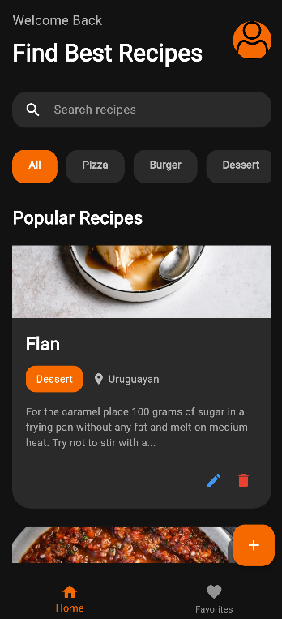
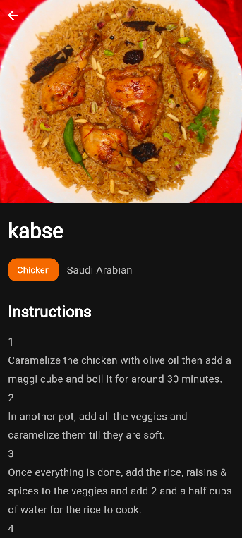
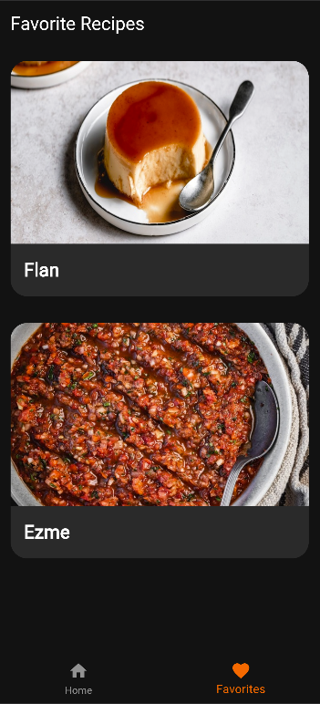

# Recipe Manager App

A Flutter CRUD application built using the Bloc state management solution and the Dio package.

This project was developed as part of a Flutter assignment focused on:

- CRUD API consumption
- State management using Bloc
- Dio networking
- Clean Flutter architecture
- Error handling and loading states

# Features

## CRUD Operations

- Create recipes
- Read real recipes from API
- Update recipes
- Delete recipes

---

## UI Features

- Custom splash screen
- Beautiful modern recipe UI
- Real recipe images
- Search functionality
- Favorite recipes system
- Bottom navigation
- Pull-to-refresh support
- Snackbar notifications
- Loading indicators
- Error handling
- Responsive layout
- Filter Based on Category

---

# API

This application uses TheMealDB API to fetch real recipes.
API used:

https://www.themealdb.com/api.php

# Technologies Used

- Flutter
- Dart
- flutter_bloc
- Dio Package
- REST API
- TheMealDB API

---

# Project Structure

lib/
│
├── bloc/
│   ├── recipe_bloc.dart
│   ├── recipe_event.dart
│   └── recipe_state.dart
│
├── models/
│   └── recipe_model.dart
│
├── screens/
│   ├── splash_screen.dart
│   ├── home_screen.dart
│   ├── recipe_detail_screen.dart
│   ├── add_recipe_screen.dart
│   ├── edit_recipe_screen.dart
│   ├── favorites_screen.dart
│   └── main_navigation_screen.dart
│
├── services/
│   └── recipe_service.dart
│
├── theme/
│   └── app_theme.dart
│
└── main.dart

# ScreenShots

## Splash Screen

## Home Screen

## Recipe Detail Screen

## Favourite Screen

## Add Recipe Screen

# CRUD Explanantion

## Create
Users can add their own custom recipes.

---

## Read
The application fetches real recipes from TheMealDB API.

---

## Update 
Users can edit existing recipes.

---

## Delete
Users can remove recipes from the application.

---

## Error Handling

The Application includes:

- Loading indicators
- API exception handling
- Image fallback handling
- Snackbar notifications

---

# Author

Omer Abubeker

